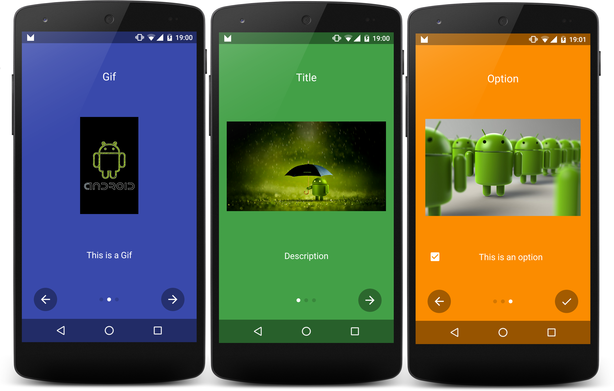

# Introduction [](https://jitpack.io/#rubengees/introduction/)  [](https://circleci.com/gh/rubengees/introduction)

Show a beautiful Intro to your users with ease.



### Include in your Project

Add this to your build.gradle:

```groovy
repositories {
    maven { url "https://jitpack.io" }
}

dependencies {
    compile ('com.github.rubengees:introduction:1.3.3@aar'){
        transitive = true;
    }
}
```

If that doesn't work, look if there is a new version and the Readme was not updated yet.

If you want to use asynchronous image loading, introduced in the new version 1.1.0, you will need [Glide](https://github.com/bumptech/glide) or some other image loading library. If you want to use GIFs you will also need it.

### Usage

Create an `IntroductionBuilder` like the following:

```java
new IntroductionBuilder(this) //this is the Activity you want to start from.
```

Then add some Slides to your Introduction:

```java
new IntroductionBuilder(this).withSlides(generateSlides())
```

```java
 private List<Slide> generateSlides() {
      List<Slide> result = new ArrayList<>();

       result.add(new Slide().withTitle("Some title").withDescription("Some description").
               withColorResource(R.color.green).withImage(R.drawable.myImage));
       result.add(new Slide().withTitle("Another title").withDescription("Another description")
               .withColorResource(R.color.indigo).withImage(R.drawable.myImage2));

       return result;
    }
```

Finally introduce yourself!

```java
new IntroductionBuilder(this).withSlides(generateSlides()).introduceMyself();
```

That was easy right?

You can do many customizations, which will be covered by the following.

##### Options

You can let the user make decisions, which you can use like settings.
To do that you add an Option to your slide:

```java
new Slide().withTitle("Feature is doing something").withOption(new Option("Enable the feature"))
          .withColorResource(R.color.orange).withImage(R.drawable.image));
```

When the user completes the intro, you will receive the selected Options in `onActivityResult`.
To read the result:

```java
@Override
protected void onActivityResult(int requestCode, int resultCode, Intent data) {
     if (requestCode == IntroductionBuilder.INTRODUCTION_REQUEST_CODE &&
            resultCode == RESULT_OK) {
         String result = "User chose: ";

         for (Option option : data.<Option>getParcelableArrayListExtra(IntroductionActivity.
                 OPTION_RESULT)) {
            result += option.getPosition() //The position of the Slide
                       + (option.isActivated() ? " enabled" : " disabled");
        }
     }
}
```

The constant value of the request is 32142, so don't use that yourself.
It is possible that the user cancels the intro. If that happens, the resultCode is `RESULT_CANCELLED` and no Options are passed back.

##### Use Gifs as images

This library supports GIFs. You need to load them asynchronously as the loading may take a while:

```java
new IntroductionBuilder(this).withSlides(slides)
                .withOnSlideListener(new OnSlideListener() {
                    @Override
                    protected void onSlideInit(int position, TextView title,
                                               ImageView image, TextView description) {
                        if (position == 1) { //Assume we want to load the GIF at Slide 2 (index 1)
                            Glide.with(image.getContext()).load(R.drawable.image3).into(image);
                        }

                    }
                }).introduceMyself();
```

This will add the GIF, which will be automatically played when the users navigates to the Slide.

##### Runtime Permissions

Android Marshmallow introduced Runtime Permissions, which can be requested easily with this lib.
To do that, you can add a global listener like the following:

```java
new IntroductionBuilder(this).withSlides(slides)
                .withOnSlideListener(new OnSlideListener() {
                    @Override
                    public void onSlideChanged(int from, int to) {
                        if (from == 0 && to == 1) {
                            if (ActivityCompat.checkSelfPermission(MainActivity.this,
                                    Manifest.permission.WRITE_EXTERNAL_STORAGE)
                                    != PackageManager.PERMISSION_GRANTED) {
                                ActivityCompat.requestPermissions(MainActivity.this,
                                        new String[]{Manifest.permission.WRITE_EXTERNAL_STORAGE},
                                        12);
                            }
                        }
                    }
                }).introduceMyself();
```

You can check if the permissions were granted like the following:

```java
@Override
public void onRequestPermissionsResult(int requestCode, @NonNull String[] permissions,
                                       @NonNull int[] grantResults) {
    super.onRequestPermissionsResult(requestCode, permissions, grantResults);

     if (requestCode == 12) {
         if (grantResults[0] == PackageManager.PERMISSION_GRANTED) {
            Toast.makeText(this, "Permission was successfully granted!", Toast.LENGTH_LONG)
                     .show();
        }
    }
}
```

You can use that listener for different things too, of course!

##### Styles

There are two available styles: `Translucent` and `Fullscreen`.
To apply one of those styles, do the following:

```java
new IntroductionBuilder(this).withSlides(generateSlides())
                .withStyle(new FullscreenStyle()).introduceMyself();
```

`Translucent` is the default style.

##### Custom Views

You can supply your own View to a Slide instead of just setting the title, image and description.  
This is done like follows:

Create a class which implements CustomViewBuilder:  
(Note: This *must* be a class on its own. Don't anonymously implement this)

```java
public class CustomViewBuilderImpl implements Slide.CustomViewBuilder {
    @NonNull
    @Override
    public View buildView(@NonNull LayoutInflater inflater, @NonNull ViewGroup parent) {
        return inflater.inflate(R.layout.layout_custom, parent, false);
    }
}
```

Then set it to your Slide:

```java
new IntroductionBuilder(this)
        .withSlides(new Slide().withCustomViewBuilder(new CustomViewBuilderImpl())
                .withColorResource(R.color.cyan)).introduceMyself();
```

If you set a CustomViewBuilder to your Slide, all other values aside from the color are overridden. You have to manage all on your own.

##### Further reading

A much more detailed explanation with all available APIs can be found in the [Wiki](https://github.com/RubenGees/Introduction/wiki).

### Upgrade Guide

#### 1.1.0 to 1.1.1+

- The `OnSlideInit` method in the `OnSlideListener` now comes without the `Fragment context`. If you need a `Context`, call `image.getContext()`.
- There is now a class for Styles instead of an Integer. If you apply no Style, you have to do nothing, if you use one, change it to the following e.g.: `.withStyle(new FullscreenStyle())`.

#### 1.0.x to 1.1.0+

- The `OnSlideChangedListener` was renamed to `OnSlideListener`. Just rename it and it's working again.
- Asynchronous image loading is now available (and recommended!). See the [Use GIFs as drawables](#Use-Gifs-as-images) section for more info. It applies for all types of images. GIFs won't work without asynchronous loading from now on!

### Metrics

<a href="http://www.methodscount.com/?lib=com.github.rubengees%3Aintroduction%3A1.3.3"></a>  
[](https://www.codacy.com/app/geesruben/introduction?utm_source=github.com&amp;utm_medium=referral&amp;utm_content=rubengees/introduction&amp;utm_campaign=Badge_Grade)

### Acknowledgments

The images in the samples are taken from the following webpages (I do not own any of the images, all rights are reserved to their respective owners):

- [image1.jpg](https://www.flickr.com/photos/rbulmahn/6180104944/in/photolist-89W1PC-8Q713U-9BussZ-cwr9kY-9XzRzZ-83z8K5-84k3xS-adM5Y9-drdDdf-e1wXZE-6kzXBW-aq7DTw-98qbVd-83w6aa-6TYUqy-bttVPE-jPnPwv-83zc5G-9mgbHk-bmJtgf-c8f3yC-6T4zxf-83jUyV-9WRbGQ-6RrUxc-6oHoaj-7Z2YXE-oveaff-8rNmyh-f95MK4-8EFVd6-kiJrYR-9Y8USW-9qC58Z-o7ZmL9-ovdL7H-oMHywk-oMFMME-oMrEw4-oMHy8e-ovaLae-ovaL5K-ovaL2t-ovaKLZ-oMoBJr-89SKWD-89W1Bu-89SKwT-89SKwa-89W1kG)
- [image2.jpg](https://www.flickr.com/photos/uncalno/8538679708/in/photolist-e1wXZE-6kzXBW-aq7DTw-98qbVd-83w6aa-6TYUqy-bttVPE-jPnPwv-83zc5G-9mgbHk-bmJtgf-c8f3yC-6T4zxf-83jUyV-9WRbGQ-6RrUxc-6oHoaj-7Z2YXE-oveaff-8rNmyh-f95MK4-8EFVd6-kiJrYR-9Y8USW-9qC58Z-o7ZmL9-ovdL7H-oMHywk-oMFMME-oMrEw4-oMHy8e-ovaLae-ovaL5K-ovaL2t-ovaKLZ-oMoBJr-89SKWD-89W1Bu-89SKwT-89SKwa-89W1kG-89W1kb-89W1jN-89W15E-89VZRs-89VZDb-9kUiFS-9957fA-ehs7zp-5yFrKB)
- [image3.gif](http://www.modaco.com/forums/topic/344506-android-startshutdown-animation-for-i900/)

Some images and ideas are from this Repo: [AppIntro by Paolo Rotolo](https://github.com/PaoloRotolo/AppIntro)
